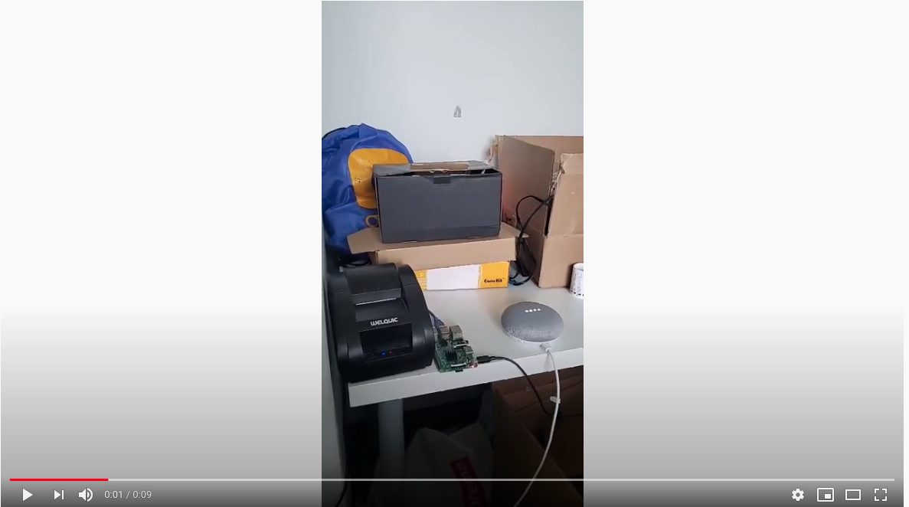
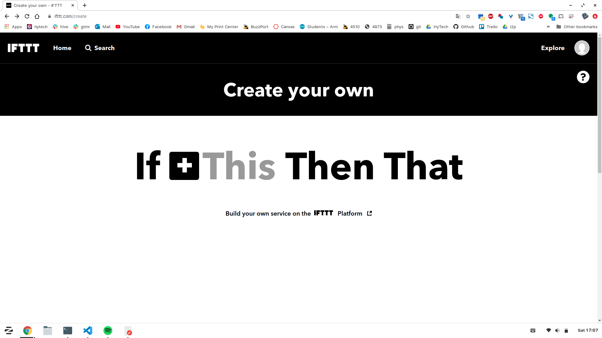
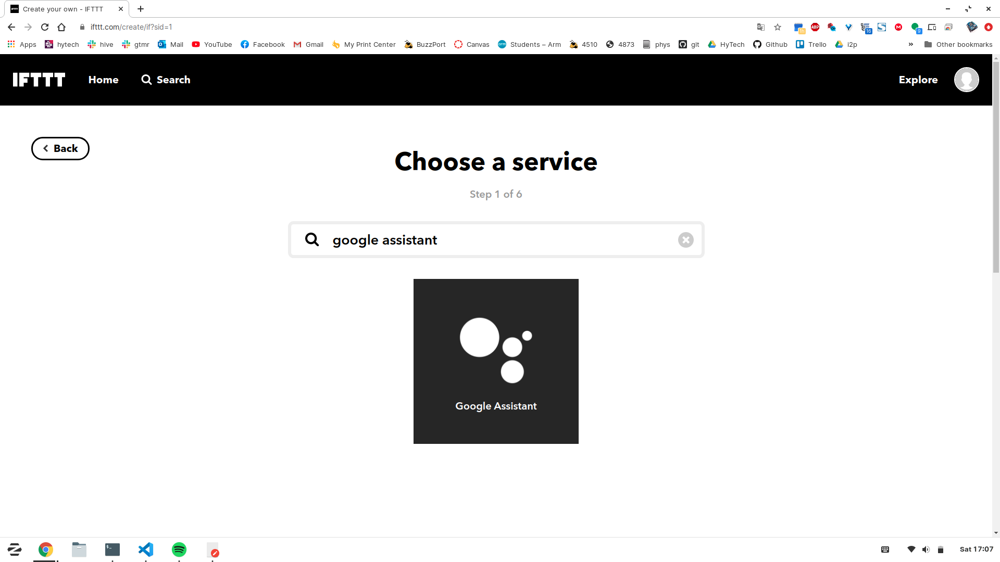
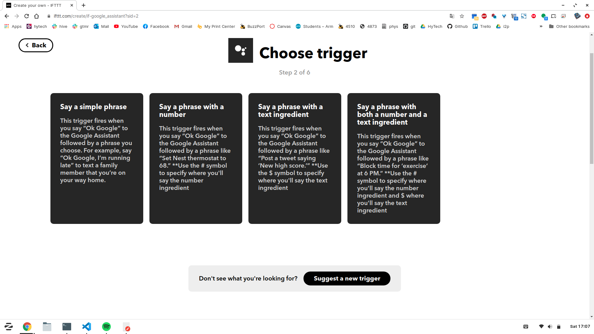
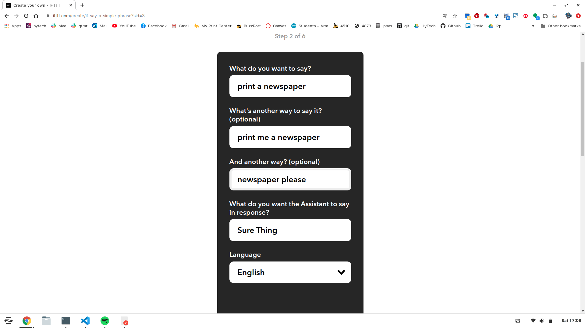
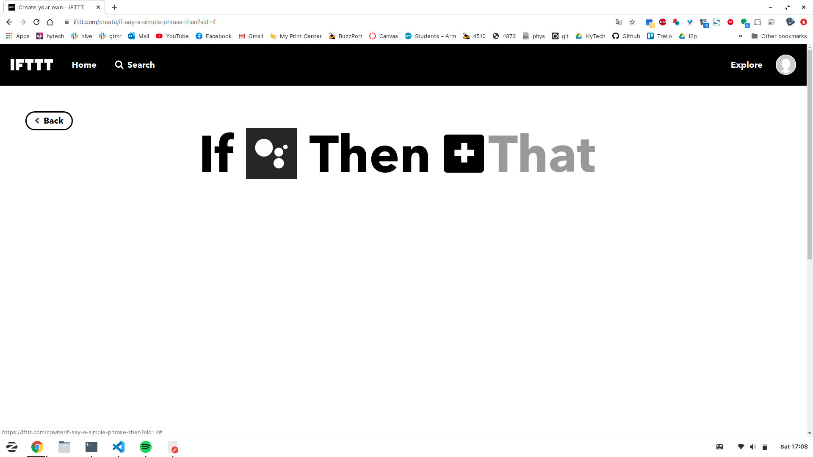
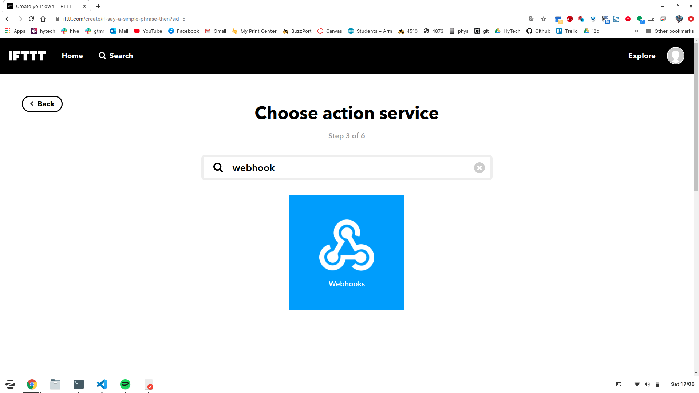
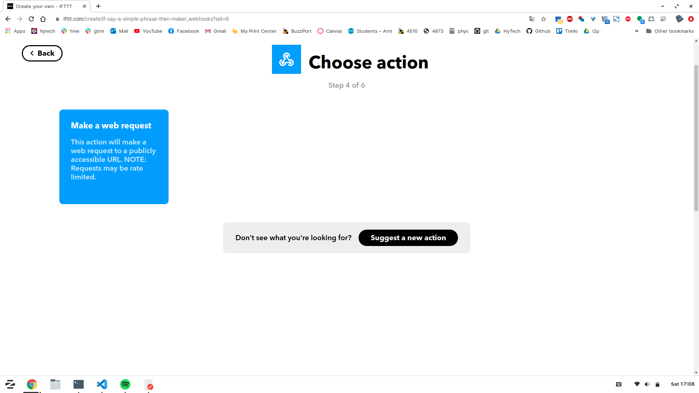
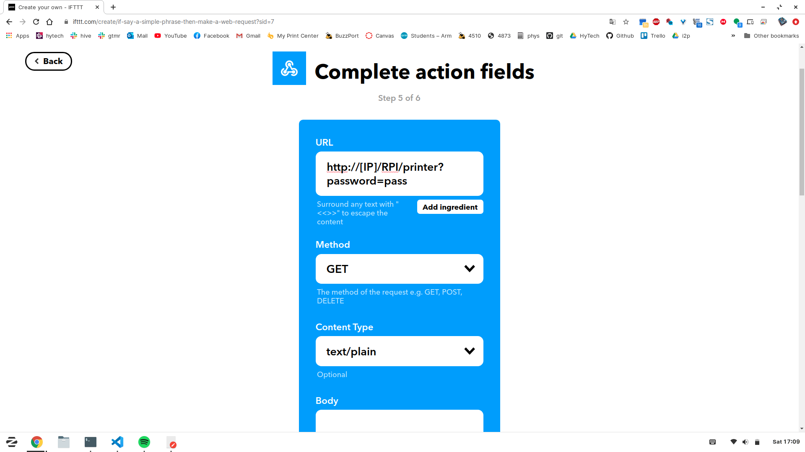
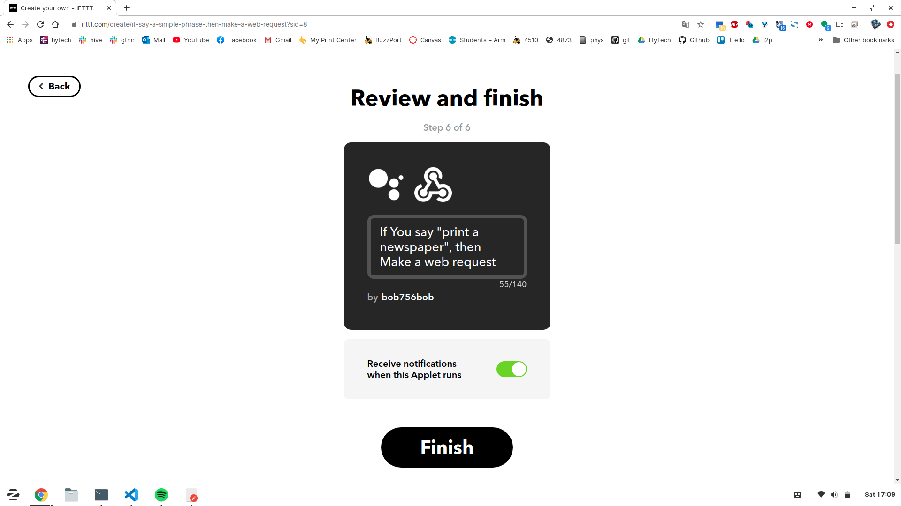

# Newspaper Please
In this project I set up a Raspberry Pi to print me a tiny physical newspaper based on several RSS feeds I follow. It is triggered via Google Assistant, allowing me to recieve a fresh and customized paper every morning.

This project also server as practice with [Go](https://golang.org/) (which I just started learning) and to finally find a use for a reciept printer I purchased on a whim years ago.

A word of warning, the password for the request recieved by the Raspberry PI is passed in plain text and there are very few security precautions taken in general.

I feel like technology just did a full-circle with this project lol.

## Printer Setup
To set up my [thermal receipt printer](https://us.amazon.com/WELQUIC-Portable-Thermal-Receipt-Compatible/dp/B075GKNY8M) I used [these instructions](https://learn.adafruit.com/networked-thermal-printer-using-cups-and-raspberry-pi/connect-and-configure-printer) provided by Adafruit. Just follow the USB instructions (not TTL) and use `lpr` to test your printer. I also tweaked the printer settings through the settings UI. I increased the default character per inch (CPI) to 20 and lines per inch (LPI) to 9. 

## Raspberry Pi Setup
Before you begin, assign your pi a static ip through your router interface and port forward port 80. This will allow our IFTT applet to send a GET request to the pi. 

Install [Go](https://golang.org/doc/install)  
Build project ith `go build .`  
Run it with `sudo ./morning-paper`

You can test your server locally with `curl -si "http://localhost/RPI/printer?password=pass"`. If the pi and printer were setup correctly it should print your news feed! 

## Google Assistant Setup
In order to trigger the printer via Google Assistant I utilized the free IFTT service. It greatly simplified the process of creating a custom assistant input and tying that to a GET request. Here are the steps I took to configure the applet.

